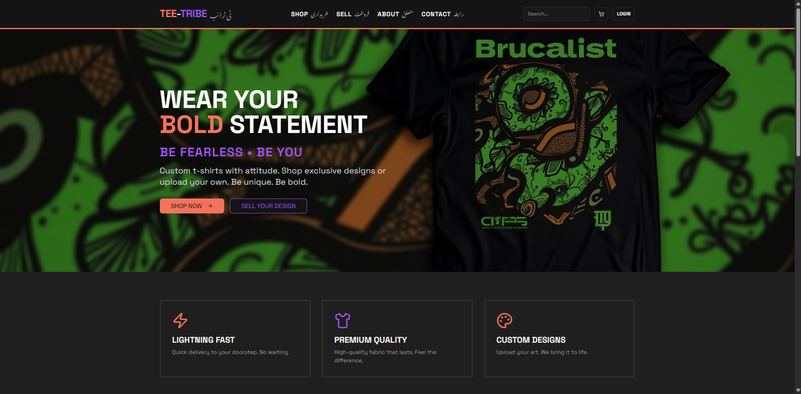
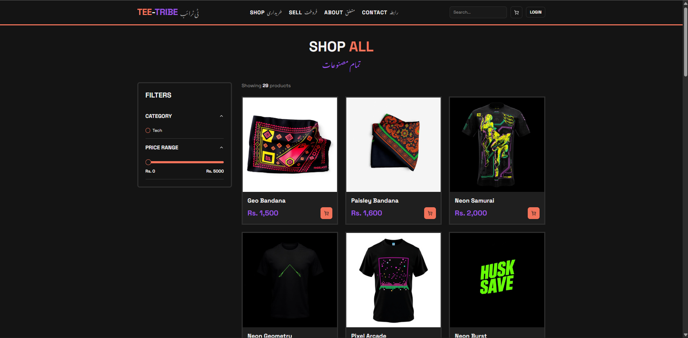
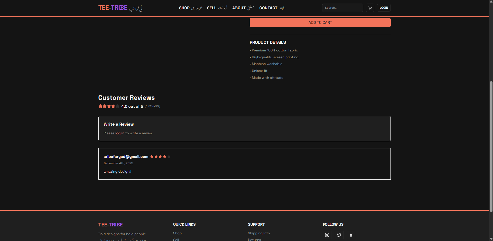
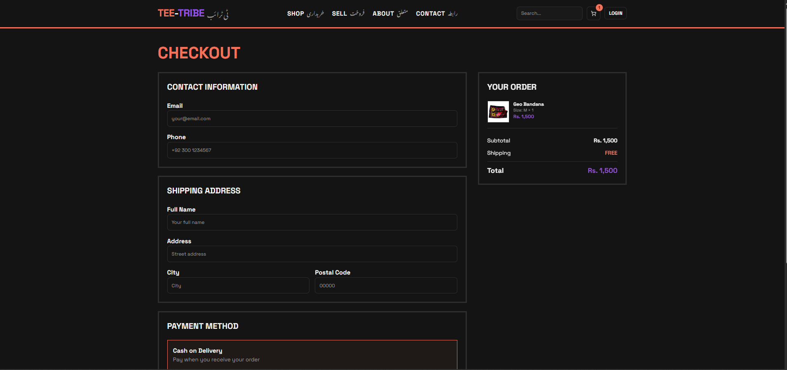
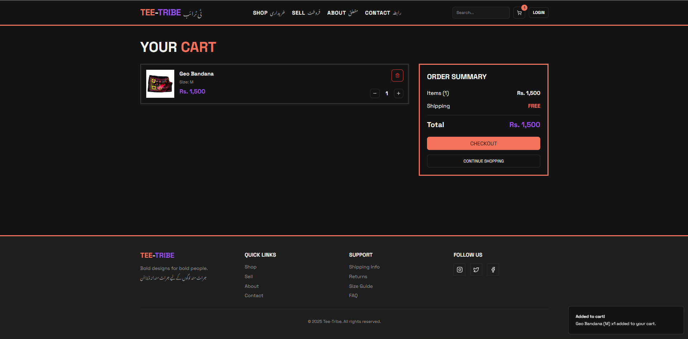
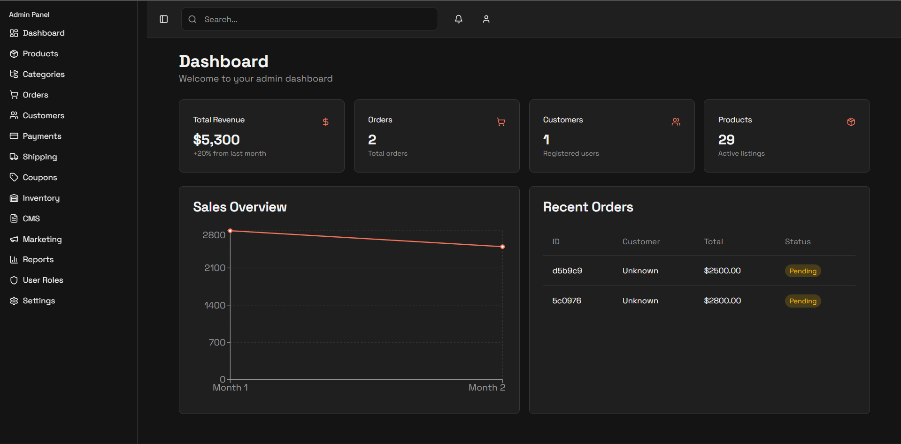
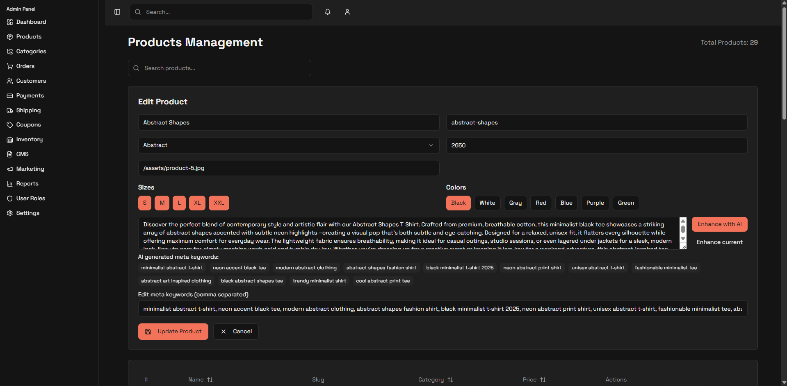

# 🛒 Tee-Tribe Shop 

**🔗 Live Application:** [Vercel App Link](https://tee-tribe.vercel.app/)

A fully featured **E-Commerce Web Application** built with:

* **React + Vite + TypeScript** Frontend
* **FastAPI** Backend
* **Stripe** Payment Processing
* **Supabase** Authentication
* **MongoDB** / **PostgreSQL** Database
* **Render** & **Vercel** Deployment

This platform supports user shopping features, secure checkout, order history, and a complete **Admin Dashboard** with role-based access.

## ✨ Features

### 👤 User Features
* 🔐 Authentication (**Supabase**)
* 🛍️ Browse products
* 🔎 Search & filter
* 🛒 Add to cart
* 💳 **Stripe** payments (test & live)
* ⭐ Product reviews
* 📦 Order history
* 📱 Responsive UI

### 🛠️ Admin Features
* 👑 Admin role authentication
* 📦 Product CRUD (Create, Read, Update, Delete)
* 🏷️ Category management
* 📊 Dashboard analytics
* 🧾 Orders & customers list
* 💳 Payments overview
* ⭐ Review management

---

## 📸 Screenshots

| Description | Screenshot |
| :--- | :--- |
| **🏠 Homepage** |  |
| **🛍️ Product Page** |   |
| **🛒 Cart & Checkout** |   |
| **🛠️ Admin Dashboard** |   |

---

## 🧱 Tech Stack

### Frontend
* **React 18**
* **Vite**
* **TypeScript**
* **TailwindCSS**
* **Stripe.js**
* **Supabase** Auth
* **Axios**

### Backend
* **FastAPI**
* **Uvicorn**
* **Stripe Python SDK**
* **MongoDB** / **PostgreSQL**
* **Python-dotenv**
* **Pydantic v2**

### Deployment
* **Vercel** (Frontend)
* **Render** (Backend)
* **Stripe Webhooks**

---

## 📁 Project Structure

swift-tribe-shop-main/
│
├── api_server/
│   ├── main.py             # FastAPI App Entry
│   ├── db.py               # Database connection/models setup
│   ├── models.py           # Pydantic and Database Models
│   ├── requirements.txt
│   └── scripts/
│
├── src/
│   ├── components/
│   ├── contexts/
│   ├── pages/
│   ├── integrations/supabase/
│   └── App.tsx
│
├── supabase/               # Supabase setup files
│   └── migrations/
│
├── public/                 # Static assets
└── package.json

---

